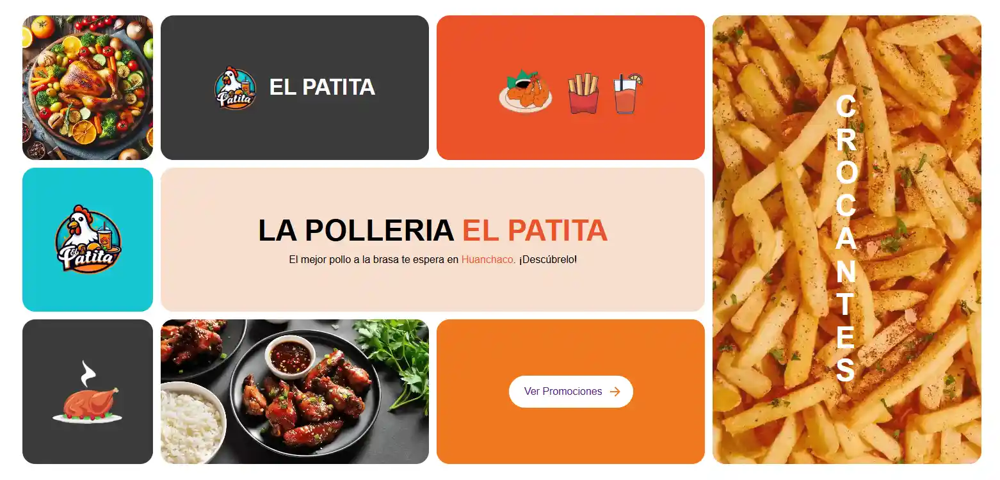

# El Patita

Bienvenido al repositorio de **elpatita**, un sitio web para un restaurante especializado en pollo a la brasa ubicado en Huanchaco.



## Descripción

Este proyecto es el sitio web oficial de El Patita. Aquí los usuarios pueden encontrar información sobre el restaurante, ver el menú, conocer la ubicación del local, y ponerse en contacto con nosotros.

## Estructura del Proyecto

- `index.html`: Página principal del sitio web con secciones para inicio, carta y local.
- `terminos-condiciones.html`: Página que contiene los términos y condiciones del servicio.
- `politicas-privacidad.html`: Página que contiene las políticas de privacidad.
- `404.html`: Página de error 404 para manejar rutas no encontradas.
- `css/`: Directorio que contiene los archivos de estilos CSS.
- `js/`: Directorio que contiene los archivos JavaScript.
- `assets/`: Directorio que contiene recursos estáticos:
  - `assets/img/`: Imágenes utilizadas en el sitio.
  - `assets/fonts/`: Fuentes tipográficas.
  - `assets/sprite.svg`: Archivo de sprites para iconos.
  - `assets/favicon.ico`: Icono del sitio.
- `sitemap.xml`: Archivo XML que ayuda a los motores de búsqueda a indexar el sitio web.
- `robots.txt`: Archivo que controla el acceso de los motores de búsqueda.
- `security.txt`: Archivo que proporciona información de contacto y políticas de seguridad.
- `README.md`: Archivo que proporciona información sobre el proyecto.
- `.editorconfig`: Archivo de configuración para mantener estilos de codificación consistentes.
- `LICENSE`: Archivo que contiene la licencia del proyecto.
- `CONTRIBUTING.md`: Archivo que proporciona guías para contribuir al proyecto.

## Características

- **Diseño Responsive**: Adaptado para dispositivos móviles, tablets y desktops.
- **Modo Oscuro**: Permite cambiar entre tema claro y oscuro según preferencia del usuario.
- **Loader**: Animación de carga para mejorar la experiencia del usuario.
- **Navegación SPA-like**: Navegación fluida entre secciones sin recargar la página.
- **Contenido Legal**: Términos y condiciones y políticas de privacidad implementadas en HTML.
- **Optimizado para SEO**: Metadatos completos, datos estructurados y enlaces canónicos.

## Instalación

1. Clona el repositorio:
   ```sh
   git clone https://github.com/tu-usuario/el-patita.git

2. Navega al directorio del proyecto:
    ```sh
   cd elpatita

## Contribución

Si deseas contribuir a este proyecto, por favor dirígete al archivo de [Guías de Contribución](./CONTRIBUTING.md).

## Licencia

Este proyecto está licenciado bajo la Licencia Creative Commons Atribución-NoComercial-CompartirIgual 4.0 Internacional. Esto significa que puedes usar, compartir y adaptar el contenido de este proyecto siempre que:
- Des crédito al autor original.
- No lo uses con fines comerciales.
- Distribuyas cualquier trabajo derivado bajo la misma licencia.

Para más detalles, consulta el archivo [LICENSE](./LICENSE) o visita [Creative Commons](https://creativecommons.org/licenses/by-nc-sa/4.0/).

## Contacto

Para cualquier consulta o sugerencia, por favor contacta a través de [steffanod948@gmail.com](mailto:steffanod948@gmail.com).

## Seguridad

Si encuentras alguna vulnerabilidad de seguridad, consulta nuestro [archivo de seguridad](./security.txt) para conocer el proceso adecuado para reportarla.

© 2025 ElPatita Todos los derechos reservados.